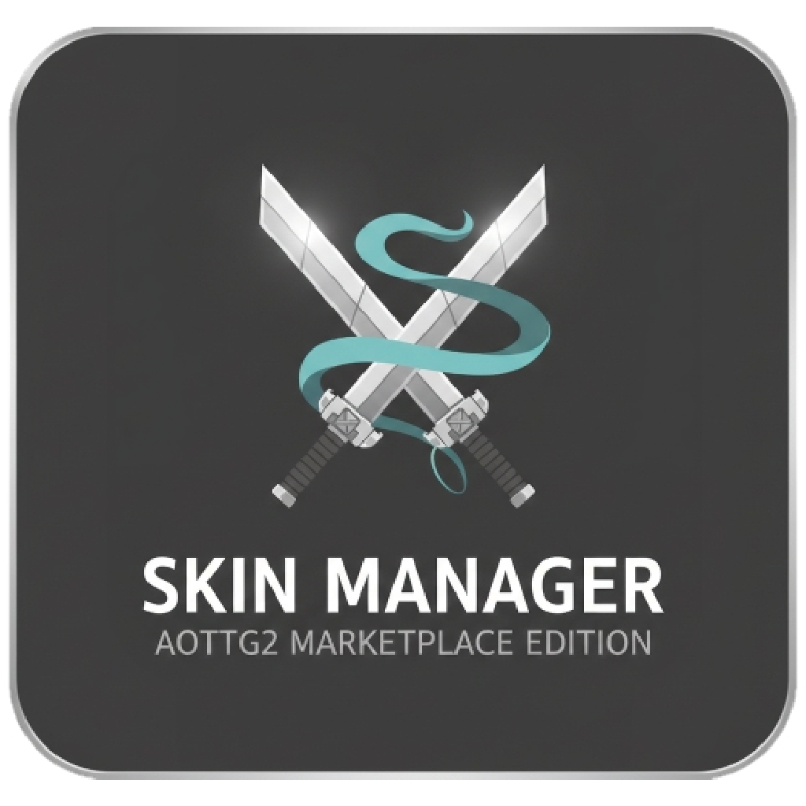

<p align="center">
  
</p>

<h1 align="center">AOTTG2 Skin Manager</h1>

<p align="center">
  A desktop app for managing your <strong>Attack on Titan Tribute Game 2</strong> custom skins.<br>
  Create, edit, and organize skin sets without touching JSON files by hand.
</p>

<p align="center">
  
  
  
</p>

---

## What It Does

AOTTG2 stores custom skins in a `CustomSkins.json` file buried in your Documents folder. This app gives you a clean interface to work with that file directly.

- **Browse all your skins** organized by category &mdash; Human, Titan, Shifter, and Skybox
- **Create new sets** with properly structured defaults, ready to fill in
- **Edit any field** &mdash; paste texture URLs, toggle options, adjust tiling values
- **Preview textures** inline before saving
- **Delete sets** you no longer need
- **Marketplace** &mdash; browse community-shared skins, import full sets or individual parts into your collection

All changes are saved directly to your `CustomSkins.json` so they're immediately available in-game.

## Installation

1. Download the latest release from the [Releases](../../releases) page
2. Run `aottg2-skin-manager.exe`
3. The app automatically finds your `CustomSkins.json` in:
   - `Documents/Aottg2/Settings/CustomSkins.json`, or
   - `OneDrive/Documents/Aottg2/Settings/CustomSkins.json`

No installation required &mdash; it's a single portable executable.

## Skin Categories

| Category | Description | Fields |
|----------|-------------|--------|
| **Human** | Player character skins | Hair, Eye, Glass, Face, Skin, Costume, Logo, Gear, Gas, Hoodie, Weapon Trail, Horse, Thunderspears, Hooks, Hat, Head, Back |
| **Titan** | Titan appearance (8 slots each) | Hairs, Bodies, Heads, Eyes + model variants, Randomized Pairs |
| **Shifter** | Shifter titan skins | Eren, Annie, Colossal |
| **Skybox** | Custom sky textures | Front, Back, Left, Right, Up, Down |

## Marketplace

Log in with Discord to access community features:

- **Browse & search** skins shared by other players
- **Import** a full set directly into any category
- **Merge** individual parts from a marketplace skin into one of your existing sets
- **Publish** your own skins for others to use
- **Upload textures** to the community CDN

## Building From Source

Requires [Go 1.21+](https://go.dev/dl/), [Node.js 18+](https://nodejs.org/), and the [Wails CLI](https://wails.io/docs/gettingstarted/installation):

```bash
# Install Wails CLI
go install github.com/wailsapp/wails/v2/cmd/wails@latest

# Clone and build
git clone https://github.com/your-repo/aottg2-skin-manager.git
cd aottg2-skin-manager
wails build
```

The built executable will be in `build/bin/`.

For development with hot reload:

```bash
wails dev
```

## Credits

Made with love by **Hollow** and the **NinjServ** community.
